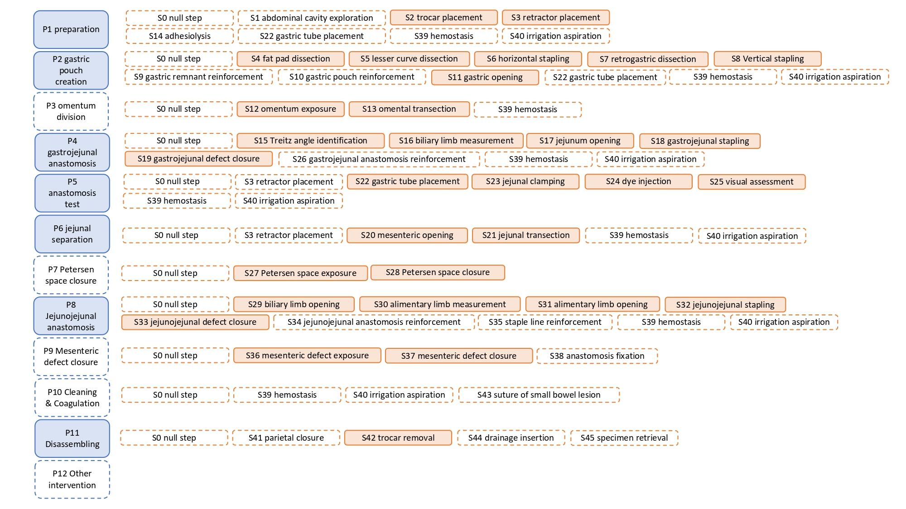

<div align="center">
<a href="http://camma.u-strasbg.fr/">

</a>
</div>


## **<p style="text-align: center;">MultiBypass140 Dataset</p>**
------------------------------------------------------
**Challenges in Multi-centric Generalization: Phase and Step Recognition in Roux-en-Y Gastric Bypass Surgery**

*Joel L. Lavanchy, Sanat Ramesh, Diego Dall’Alba, Cristians Gonzalez, Paolo Fiorini, Beat P. Muller-Stich, Philipp C. Nett, Jacques Marescaux, Didier Mutter, Nicolas Padoy, 2024*

[](https://arxiv.org/abs/2312.11250) [](https://link.springer.com/article/10.1007/s11548-024-03166-3)


MultiBypass140 is a multicentric dataset of endoscopic video of laparoscopic Roux-en-Y gastric bypass surgery introduced to facilitate research on multi-level surgical activity recognition, specifically phases, steps and interaoperative adverse events (IAEs).

## News: 
- [ **20/12/2023** ]: Release of the dataset.
- [ **29/04/2025** ]: IAE annotations integrated within the dataset.

### Introduction
<div style="text-align: left">
To facilitate research on multi-centric surgical activity recognition at multiple levels of granularity, specifically phases and steps, we introduce a large multi-centric multi-activity dataset consisting of 140 surgical videos (MultiBypass140) of laparoscopic Roux-en-Y gastric bypass (LRYGB) surgeries performed at two medical centers, i.e., the University Hospital of Strasbourg, France (StrasBypass70) and Inselspital, Bern University Hospital, Switzerland (BernBypass70). The dataset has been fully annotated by two board-certified surgeons with an ontology consisting of 12 phases, 46 steps and 5 IAEs (with 5 scale of severity). <a href="https://arxiv.org/abs/2312.11250">Lavanchy2023MultiBypass140</a> provides benchmarks for several baseline methods on the official dataset splits.
</div>


##### Hierarchical structure of phases and steps in the LRYGB ontology:
<div align="center">
<a href="http://camma.u-strasbg.fr/">

</a>
</div>


#### In this repo we provide:
- 140 LRYGB surgical videos from two centers.
- 5 fold cross-validation metadata (train, validation, and test sets) defining the official splits of the dataset, which consists of images extracted at 1 fps.
- Training pipelines for baseline spatial and temporal models (CNN, CNN + LSTM, CNN + TCN) described in [Lavanchy2023MultiBypass140](https://arxiv.org/abs/2312.11250).
- The IAE categories include bleeding, mechanical injury, thermal injury, ischmic injury and insufficient closure of anastomosis. The severity of the events in the range of 1 - 5, with 0 for "no IAE".

# Get Started

## Dataset and imagenet checkpoint
Follow these steps for MultiBypass140 dataset preparation and setting up training:

```bash
# 1. MultiBypass140 phase and step labels for different splits
> git clone https://github.com/CAMMA-public/MultiBypass140
> export MBy140=$(pwd):MultiBypass140
> cd $MBy140
> mkdir models
# 2. Download the dataset:  
> mkdir datasets && cd datasets
> mkdir MultiBypass140 && cd MultiBypass140
> wget https://s3.unistra.fr/camma_public/datasets/MultiBypass140/multibypass01.zip
> wget https://s3.unistra.fr/camma_public/datasets/MultiBypass140/multibypass02.zip
> wget https://s3.unistra.fr/camma_public/datasets/MultiBypass140/multibypass03.zip
> wget https://s3.unistra.fr/camma_public/datasets/MultiBypass140/multibypass04.zip
> wget https://s3.unistra.fr/camma_public/datasets/MultiBypass140/multibypass05.zip
## If you wish to also utilize the IAE labels, run:
> wget https://s3.unistra.fr/camma_public/datasets/MultiBypass140/multibypass06.zip
# Unzip all the videos
> unzip multibypass*.zip
# 3. Setup dataset for training
> cd $MBy140
# a) Extract frames at 1 fps (default)
> python util/extract_frames.py --video_path datasets/MultiBypass140/BernBypass70/videos --output datasets/MultiBypass140/BernBypass70/frames/
> python util/extract_frames.py --video_path datasets/MultiBypass140/StrasBypass70/videos --output datasets/MultiBypass140/StrasBypass70/frames/
# b) Symlink frames to labels metadata
> cd $MBy140/labels/bern/labels_by70_splits
> ln -s $MBy140/datasets/BernBypass70/frames/ frames
> cd $MBy140/labels/strasbourg/labels_by70_splits
> ln -s $MBy140/datasets/StrasBypass70/frames/ frames
```

- Directory structure should look as follows.
```shell
$MBy140
└── labels
    ├── strasbourg/labels_by70_splits
    │   ├── frames
    │   │   ├── SBP01/
    │   │   │   ├── img1.jpg
    │   │   │   ├── img2.jpg
    │   │   │   └── ...
    │   │   ├── SBP02/
    │   │   │   ├── img1.jpg
    │   │   │   ├── img2.jpg
    │   │   │   └── ...
    │   │   └── SBP70/
    │   │       ├── img1.jpg
    │   │       ├── img2.jpg
    │   │       └── ...
    │   └── labels/
    │       ├── train/
    │       │   ├── 1fps_100_0.pickle
    │       │   ├── 1fps_100_0_with_iae.pickle
    │       │   ├── 1fps_100_1.pickle
    │       │   ├── 1fps_100_1_with_iae.pickle
    │       │   └── ...
    │       ├── val/
    │       │   ├── 1fps_0.pickle
    │       │   ├── 1fps_0_with_iae.pickle
    │       │   ├── 1fps_1.pickle
    │       │   ├── 1fps_1_with_iae.pickle
    │       │   └── ...
    │       └── test/
    │           ├── 1fps_0.pickle
    │       │   ├── 1fps_0_with_iae.pickle
    │       │   ├── 1fps_1.pickle
    │       │   ├── 1fps_1_with_iae.pickle
    │           └── ...
    └── bern/labels_by70_splits
        ├── frames
        │   ├── BBP01/
        │   │   ├── img1.jpg
        │   │   ├── img2.jpg
        │   │   └── ...
        │   └── BBP70/
        │       ├── img1.jpg
        │       ├── img2.jpg
        │       └── ...
        └── labels/
            ├── train/
            │   ├── 1fps_100_0.pickle
            │   ├── 1fps_100_0_with_iae.pickle
            │   ├── 1fps_100_1.pickle
            │   ├── 1fps_100_1_with_iae.pickle
            │   └── ...
            ├── val/
            │   ├── 1fps_0.pickle
            │   ├── 1fps_0_with_iae.pickle
            │   ├── 1fps_1.pickle
            │   ├── 1fps_1_with_iae.pickle
            │   └── ...
            └── test/
                ├── 1fps_0.pickle
                ├── 1fps_0_with_iae.pickle
                ├── 1fps_1.pickle
                ├── 1fps_1_with_iae.pickle
                └── ...
``` 

 # Installation
You need to have a [Anaconda3](https://www.anaconda.com/products/individual#linux) or [Virtualenv](https://virtualenv.pypa.io/en/latest/installation.html) installed for the setup. We developed the code on the Ubuntu 20.04, Python 3.8, PyTorch 2.0.1, and CUDA 12.0.
```sh
> cd $MBy140
> virtualenv venvby140 -p python=3.8 && source venvby140/bin/activate
# or
# > conda create -n venvby140 python=3.8 && conda activate venvby140
# install dependencies 
(venvby140) > pip install -r requirements.txt
```


## Training

### 1. Setup configuration files

The config files for the surgical phase/step recognition experiments are in [bern](hparams/bern_by70/), [strasbourg](hparams/bern_by70/), and [multibypass](hparams/multi_by140/). The config files are organized as follows:

<details>
<summary>config_files</summary>

```sh
# config files on the bern dataset are organized as follows:
hparams/
├── bern_by70/series_01/
│   ├── CNN #(100 % of cholec 80)
│   │   ├── h001.yaml # Phase recognition
│   │   ├── h002.yaml # Step Recognition
│   │   └── h003.yaml # Joint Phase-Step recognition
│   ├── MT_LSTM #(100 % of cholec 80)
│   │   ├── h001.yaml # Phase recognition
│   │   ├── h002.yaml # Step Recognition
│   │   └── h003.yaml # Joint Phase-Step recognition
│   └── MTMS_TCN #(100 % of cholec 80)
│       ├── h001.yaml # Phase recognition
│       ├── h002.yaml # Step Recognition
│       └── h003.yaml # Joint Phase-Step recognition
# config files on the strasbourg dataset are organized as follows:
├── stras_by70/series_01/
│   ├── CNN #(100 % of cholec 80)
│   │   ├── h001.yaml # Phase recognition
│   │   ├── h002.yaml # Step Recognition
│   │   └── h003.yaml # Joint Phase-Step recognition
│   ├── MT_LSTM #(100 % of cholec 80)
│   │   ├── h001.yaml # Phase recognition
│   │   ├── h002.yaml # Step Recognition
│   │   └── h003.yaml # Joint Phase-Step recognition
│   └── MTMS_TCN #(100 % of cholec 80)
│       ├── h001.yaml # Phase recognition
│       ├── h002.yaml # Step Recognition
│       └── h003.yaml # Joint Phase-Step recognition
# config files on the strasbourg dataset are organized as follows:
└── multi_by140/series_01/
    ├── CNN #(100 % of cholec 80)
    │   ├── h001.yaml # Phase recognition
    │   ├── h002.yaml # Step Recognition
    │   └── h003.yaml # Joint Phase-Step recognition
    ├── MT_LSTM #(100 % of cholec 80)
    │   ├── h001.yaml # Phase recognition
    │   ├── h002.yaml # Step Recognition
    │   └── h003.yaml # Joint Phase-Step recognition
    └── MTMS_TCN #(100 % of cholec 80)
        ├── h001.yaml # Phase recognition
        ├── h002.yaml # Step Recognition
        └── h003.yaml # Joint Phase-Step recognition
```
</details>


### 2. Setup execution scripts

The config files for the surgical phase/step recognition experiments are in [bern](jobs/bern_by70/), [strasbourg](jobs/bern_by70/), and [multibypass](jobs/multi_by140/). The config files are organized as follows:
<details>
<summary>config_files</summary>

```sh
# config files on the bern dataset are organized as follows:
jobs/
├── bern_by70/series_01/
│   ├── CNN #(100 % of cholec 80)
│   │   ├── s001.sh # Phase recognition
│   │   ├── s002.sh # Step Recognition
│   │   └── s003.sh # Joint Phase-Step recognition
│   ├── MT_LSTM #(100 % of cholec 80)
│   │   ├── s001.sh # Phase recognition
│   │   ├── s002.sh # Step Recognition
│   │   └── s003.sh # Joint Phase-Step recognition
│   └── MTMS_TCN #(100 % of cholec 80)
│       ├── s001.sh # Phase recognition
│       ├── s002.sh # Step Recognition
│       └── s003.sh # Joint Phase-Step recognition
# config files on the strasbourg dataset are organized as follows:
├── stras_by70/series_01/
│   ├── CNN #(100 % of cholec 80)
│   │   ├── s001.sh # Phase recognition
│   │   ├── s002.sh # Step Recognition
│   │   └── s003.sh # Joint Phase-Step recognition
│   ├── MT_LSTM #(100 % of cholec 80)
│   │   ├── s001.sh # Phase recognition
│   │   ├── s002.sh # Step Recognition
│   │   └── s003.sh # Joint Phase-Step recognition
│   └── MTMS_TCN #(100 % of cholec 80)
│       ├── s001.sh # Phase recognition
│       ├── s002.sh # Step Recognition
│       └── s003.sh # Joint Phase-Step recognition
# config files on the strasbourg dataset are organized as follows:
└── multi_by140/series_01/
    ├── CNN #(100 % of cholec 80)
    │   ├── s001.sh # Phase recognition
    │   ├── s002.sh # Step Recognition
    │   └── s003.sh # Joint Phase-Step recognition
    ├── MT_LSTM #(100 % of cholec 80)
    │   ├── s001.sh # Phase recognition
    │   ├── s002.sh # Step Recognition
    │   └── s003.sh # Joint Phase-Step recognition
    └── MTMS_TCN #(100 % of cholec 80)
        ├── s001.sh # Phase recognition
        ├── s002.sh # Step Recognition
        └── s003.sh # Joint Phase-Step recognition
```
</details>

### 3. Run the scripts for training 

1. First run the following code for the training of CNN on the dataset with 2 GPUS.
```sh
# CNN on BernBypass70
(venvby140) > cd $MBy140/jobs/bern_by70/series_01/CNN/ 
(venvby140) > sh s001.sh # Phase recognition
(venvby140) > sh s002.sh # Step recognition
(venvby140) > sh s003.sh # Joint Phase and Step recognition
# CNN on StrasBypass70
(venvby140) > cd $MBy140/jobs/stras_by70/series_01/CNN/ 
(venvby140) > sh s001.sh # Phase recognition
(venvby140) > sh s002.sh # Step recognition
(venvby140) > sh s003.sh # Joint Phase and Step recognition
# CNN on MultiBypass140
(venvby140) > cd $MBy140/jobs/multi_by140/series_01/CNN/ 
(venvby140) > sh s001.sh # Phase recognition
(venvby140) > sh s002.sh # Step recognition
(venvby140) > sh s003.sh # Joint Phase and Step recognition
```

2. After CNN training, run the following code for the training of LSTM on the dataset with 1 GPU.
```sh
# CNN on BernBypass70
(venvby140) > cd $MBy140/jobs/bern_by70/series_01/MT_LSTM/ 
(venvby140) > sh s001.sh # Phase recognition
(venvby140) > sh s002.sh # Step recognition
(venvby140) > sh s003.sh # Joint Phase and Step recognition
# CNN on StrasBypass70
(venvby140) > cd $MBy140/jobs/stras_by70/series_01/MT_LSTM/
(venvby140) > sh s001.sh # Phase recognition
(venvby140) > sh s002.sh # Step recognition
(venvby140) > sh s003.sh # Joint Phase and Step recognition
# CNN on MultiBypass140
(venvby140) > cd $MBy140/jobs/multi_by140/series_01/MT_LSTM/ 
(venvby140) > sh s001.sh # Phase recognition
(venvby140) > sh s002.sh # Step recognition
(venvby140) > sh s003.sh # Joint Phase and Step recognition
```

3. After CNN training, run the following code for the training of MTMS-TCN on the dataset with 1 GPU.
```sh
# CNN on BernBypass70
(venvby140) > cd $MBy140/jobs/bern_by70/series_01/MTMS_TCN/ 
(venvby140) > sh s001.sh # Phase recognition
(venvby140) > sh s002.sh # Step recognition
(venvby140) > sh s003.sh # Joint Phase and Step recognition
# CNN on StrasBypass70
(venvby140) > cd $MBy140/jobs/stras_by70/series_01/MTMS_TCN/  
(venvby140) > sh s001.sh # Phase recognition
(venvby140) > sh s002.sh # Step recognition
(venvby140) > sh s003.sh # Joint Phase and Step recognition
# CNN on MultiBypass140
(venvby140) > cd $MBy140/jobs/multi_by140/series_01/MTMS_TCN/  
(venvby140) > sh s001.sh # Phase recognition
(venvby140) > sh s002.sh # Step recognition
(venvby140) > sh s003.sh # Joint Phase and Step recognition
```

### 4. Evaluation

Example command to evaluate all the experiments and collect the results
```sh

# computes evaluation metrics for all the experiments and saves them in the results folder
(venvby140) > python utils/results_collator.py -e models/ # (or specific experiment folder path)
```


## Citation

```bibtex
@article{Lavanchy2024,
  title = {Challenges in multi-centric generalization: phase and step recognition in Roux-en-Y gastric bypass surgery},
  ISSN = {1861-6429},
  url = {http://dx.doi.org/10.1007/s11548-024-03166-3},
  DOI = {10.1007/s11548-024-03166-3},
  journal = {International Journal of Computer Assisted Radiology and Surgery},
  publisher = {Springer Science and Business Media LLC},
  author = {Lavanchy,  Joël L. and Ramesh,  Sanat and Dall’Alba,  Diego and Gonzalez,  Cristians and Fiorini,  Paolo and M\"{u}ller-Stich,  Beat P. and Nett,  Philipp C. and Marescaux,  Jacques and Mutter,  Didier and Padoy,  Nicolas},
  year = {2024},
  month = may 
}
```

If you used the IAE annotations, please cite:

```bibtex
@article{bose2025feature,
  title={Feature Mixing Approach for Detecting Intraoperative Adverse Events in Laparoscopic Roux-en-Y Gastric Bypass Surgery},
  author={Bose, Rupak and Nwoye, Chinedu Innocent and Lazo, Jorge and Lavanchy, Jo{\"e}l Lukas and Padoy, Nicolas},
  journal={arXiv preprint arXiv:2504.16749},
  year={2025}
}
```


### References

```bibtex
@article{lavanchy2023proposal,
  doi = {10.1007/s00464-022-09745-2},
  title={Proposal and multicentric validation of a laparoscopic Roux-en-Y gastric bypass surgery ontology},
  author={Lavanchy, Jo{\"e}l L and Gonzalez, Cristians and Kassem, Hasan and Nett, Philipp C and Mutter, Didier and Padoy, Nicolas},
  journal={Surgical endoscopy},
  volume={37},
  number={3},
  pages={2070--2077},
  year={2023},
  publisher={Springer}
}
```
```bibtex
@article{Ramesh2021,
  doi = {10.1007/s11548-021-02388-z},
  url = {https://doi.org/10.1007/s11548-021-02388-z},
  year = {2021},
  month = may,
  publisher = {Springer Science and Business Media {LLC}},
  author = {Sanat Ramesh and Diego Dall'Alba and Cristians Gonzalez and Tong Yu and Pietro Mascagni and Didier Mutter and Jacques Marescaux and Paolo Fiorini and Nicolas Padoy},
  title = {Multi-task temporal convolutional networks for joint recognition of surgical phases and steps in gastric bypass procedures},
  journal = {International Journal of Computer Assisted Radiology and Surgery}
}
```

```bibtex
@ARTICLE{Ramesh2023Weak,
  author={Ramesh, Sanat and DalľAlba, Diego and Gonzalez, Cristians and Yu, Tong and Mascagni, Pietro and Mutter, Didier and Marescaux, Jacques and Fiorini, Paolo and Padoy, Nicolas},
  journal={IEEE Transactions on Medical Imaging}, 
  title={Weakly Supervised Temporal Convolutional Networks for Fine-Grained Surgical Activity Recognition}, 
  year={2023},
  volume={42},
  number={9},
  pages={2592-2602},
  doi={10.1109/TMI.2023.3262847}}
}
```

## License
This code, models, and datasets are available for non-commercial scientific research purposes as defined in the [CC BY-NC-SA 4.0](https://creativecommons.org/licenses/by-nc-sa/4.0/). By downloading and using this code you agree to the terms in the [LICENSE](LICENSE). Third-party codes are subject to their respective licenses.
